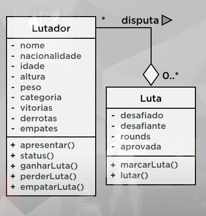

# Aulas 07 e 08

## Ultra Emoji Combat :sunglasses::angry::nerd_face::alien::grimacing::skull:

Este projeto foi baseado no seguinte diagrama de classes:

**Aprendizados da aula**

* Relacionamento entre classes;
* Objetos compostos;
* Relacionamento de agregação;
* Agregação entre objetos;
* Tipo abstrato de dados.